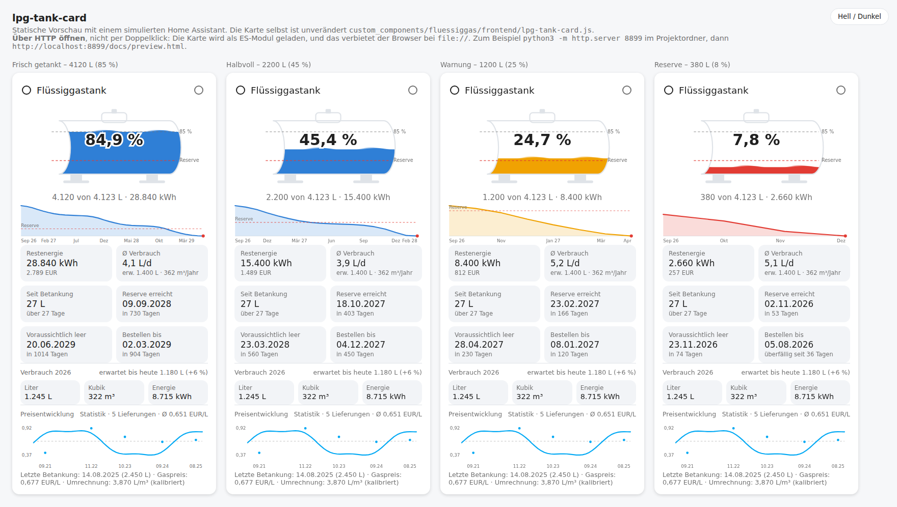

# Flüssiggastank für Home Assistant

Eine Integration, die aus dem Gasverbrauch deiner Heizung den Füllstand eines
Flüssiggastanks fortschreibt – mit saisonaler Prognose, wann er leer ist, und
einer grafischen Karte fürs Dashboard.

**Kein Sensor am Tank nötig.** Der Füllstand ergibt sich aus dem letzten
bekannten Stand minus dem gemessenen Verbrauch; beim Tanken oder beim Ablesen
der Tankuhr wird er wieder auf die Realität gesetzt.



## Installation

### Über HACS (empfohlen)

> HACS lädt die Dateien ohne Token von `raw.githubusercontent.com` – das
> **Repository muss dafür öffentlich sein**. Ist es privat, meldet HACS
> `No manifest.json file found 'custom_components/None/manifest.json'`;
> dann bleibt der Weg von Hand.

1. HACS → ⋮ → **Benutzerdefinierte Repositories** → `https://github.com/tach2004/ha-fluessiggasverbrauch`, Kategorie **Integration**.
2. „Flüssiggastank" herunterladen, Home Assistant neu starten.
3. **Einstellungen → Geräte & Dienste → Integration hinzufügen → Flüssiggastank**.

### Von Hand

Ordner `custom_components/fluessiggas` nach `<config>/custom_components/`
kopieren und neu starten.

Die Lovelace-Karte bringt die Integration mit und meldet sie selbst an – ein
Eintrag unter *Dashboards → Ressourcen* ist **nicht** nötig.

## Einrichtung

Alles läuft über die Oberfläche, es gibt kein YAML zu editieren:

| Schritt 1 | Schritt 2 |
|---|---|
| Verbrauchssensoren auswählen (mehrere werden addiert) | Umrechnung m³ → Liter |
| Einheit (automatisch erkannt: m³, L oder kWh) | Energieinhalt je Liter |
| Nennvolumen des Tanks | Gaspreis je Liter |
| Maximaler Füllgrad (bei Flüssiggas 85 %) | Reserve, Vorlaufzeit, Prognosejahre |

Danach einmal den Dienst **Füllstand setzen** mit dem abgelesenen Wert der
mechanischen Tankuhr aufrufen – oder in der Karte oben rechts aufs
Zapfsäulen-Symbol. Ab da läuft alles allein.

Alle Werte sind später unter **Konfigurieren** änderbar.

## Die Karte

```yaml
type: custom:lpg-tank-card
```

Mehr braucht es nicht: Die Karte erkennt den Tank an Attributen, die die
Integration setzt – unabhängig von Sprache und Entity-IDs.

```yaml
type: custom:lpg-tank-card
tank: Gartenhaus       # nur nötig, wenn mehrere Tanks eingerichtet sind
warn_prozent: 25       # ab hier gelb (% der nutzbaren Füllung)
alarm_prozent: 12      # ab hier rot
verlauf: true          # Restverlauf der kommenden Monate
preisverlauf: true     # Preisentwicklung der eingetragenen Lieferungen
betankung: true        # Betankungsformular
wellen: true           # Wellenanimation
```

Die Karte zeigt sechs Kennzahlen unter dem Tank – Restenergie, Ø Verbrauch,
Reichweite, **Reserve erreicht**, voraussichtlich leer und Bestellfrist – sowie
darunter die Preisentwicklung, sobald zwei Lieferungen mit Preis eingetragen sind.

## Entitäten

Je Tank entsteht ein Gerät mit 14 Sensoren:

| Sensor | Bedeutung |
|---|---|
| Füllstand | Liter im Tank |
| Tankuhr | % vom Nennvolumen – wie die mechanische Anzeige |
| Füllung | % der nutzbaren Menge, 100 % = randvoll getankt |
| Restenergie / Restwert | kWh und EUR |
| Gaspreis | EUR/L, mit Langzeitstatistik – daraus wird der Preisverlauf |
| Verbrauch seit Betankung | Liter seit dem letzten Bezugspunkt |
| Tagesverbrauch | Ø Liter pro Tag |
| Jahresverbrauch | erwarteter Jahresverbrauch, Attribut `monatsprofil` |
| Reichweite | Tage bis leer, Attribut `monate` mit dem Verlauf |
| Leer am / Reserve erreicht am / Bestellen bis | konkrete Daten |
| Letzte Betankung | Datum, Attribut `lieferungen` mit der Historie |

Dazu kommt die Zahl **Gaspreis** (EUR/L) zum Eintragen – außer du hast in der
Konfiguration einen eigenen Preis-Helfer angegeben, dann bleibt deiner die Quelle.

## Dienste

| Dienst | Zweck |
|---|---|
| `fluessiggas.betankung` | Lieferung eintragen – auch eine Teilbetankung |
| `fluessiggas.fuellstand_setzen` | Tankuhr abgelesen, Zählung neu starten |
| `fluessiggas.profil_neu_berechnen` | Monatsprofil sofort neu aus der Statistik lesen |

### Teilbetankung

Der neue Stand ist **Stand davor + Liefermenge**, nicht „voll". Wer 1.000 L auf
einen halbleeren Tank tankt, landet auch bei halbleer plus 1.000 L. Drei
Angaben, alle optional kombinierbar:

* `liter` – Liefermenge laut Lieferschein
* `fuellstand_vorher_prozent` – Tankuhr vor der Lieferung; damit kalibriert
  sich die Umrechnung m³ → Liter automatisch an deiner Anlage
* `fuellstand_nachher_prozent` – Tankuhr danach; hat Vorrang, weil direkt gemessen

`datum` trägt eine Betankung auch nachträglich ein: Die Integration holt sich
die Statistiksumme von genau diesem Tag, der Verbrauch danach bleibt korrekt.

## Gaspreis

Der Preis ist immer **EUR je Liter** – in der Anzeige wie in der Eingabe.

* **Ohne eigenen Helfer** legt die Integration die Zahl *Gaspreis* an. Anders als
  eine `input_number` ist der zugehörige Sensor mit `state_class: measurement`
  ausgestattet und landet damit in der Langzeitstatistik: Der Preisverlauf
  bleibt über Jahre erhalten.
* **Mit eigenem Helfer** (Feld *Vorhandener Preis-Helfer*) bleibt deine
  `input_number` die Quelle. Steht sie in EUR/m³, rechnet die Integration mit dem
  konfigurierten Faktor selbst in Liter um.

Trägst du beim Tanken einen Preis ein, wird er übernommen: in den eigenen
Helfer zurückgeschrieben, wenn er beschreibbar ist, sonst intern gemerkt. Jede
Lieferung landet mit Datum, Menge, Preis und Kosten in der Historie – daraus
zeichnet die Karte die Preisentwicklung.

## Wie die Prognose rechnet

Ein Tagesdurchschnitt taugt nicht – im Januar geht rund zehnmal so viel weg wie
im Juli. Die Integration liest deshalb den Monatsverbrauch der letzten Jahre aus
der Langzeitstatistik, mittelt ihn je Kalendermonat und simuliert damit Monat
für Monat in die Zukunft. Innerhalb des angebrochenen Monats wird linear
interpoliert – heraus kommt ein Datum, kein „ungefähr acht Monate".

Monate ohne Messwerte werden nicht mit 0 angesetzt, sondern über die Form einer
typischen Heizkurve ergänzt und auf das Niveau der gemessenen Monate skaliert.
Dadurch ist die Prognose schon nach einer halben Heizperiode brauchbar.

Details und die Entscheidungen dahinter: [docs/KONZEPT.md](docs/KONZEPT.md).

## Vorgaben für Propan (DIN 51622)

| Größe | Wert |
|---|---|
| 1 m³ Gas | ≈ 3,92 L flüssig |
| Energieinhalt | 7,0 kWh/L (Heizwert 6,57 / Brennwert 7,11) |
| Maximaler Füllgrad | 85 % – der Rest ist Ausdehnungsraum |
| Reserve (Vorgabe) | 970 L = 20 % vom Nennvolumen |

Beispiel: 4.850 L Nennvolumen → 4.122 L nutzbar → rund **28.800 kWh**.

## Logo

Home Assistant lädt Integrations-Logos ausschließlich von
`brands.home-assistant.io`; eine custom integration kann ihres nicht
mitliefern. Das fertige Symbol liegt in [`brands/`](brands/) samt Anleitung zum
Eintragen. Die Symbole der Entitäten und Dienste bestimmt die Integration
dagegen selbst – die wirken sofort.

## Tests

```bash
python3 tests/test_forecast.py          # Prognoserechnung
python3 tests/test_integration_files.py # Manifest, Dienste, Übersetzungen
```

## Lizenz

MIT
